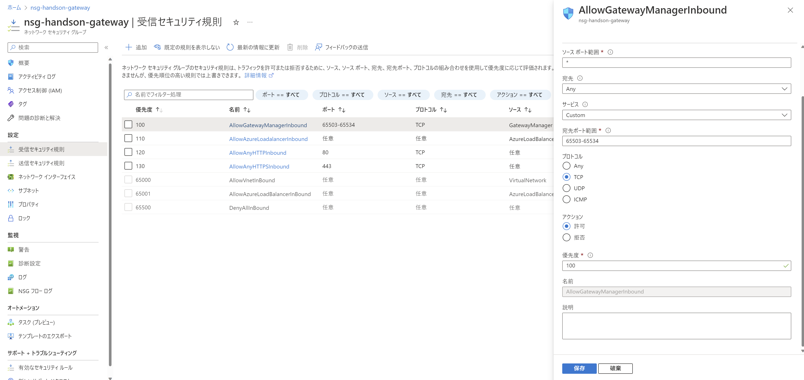
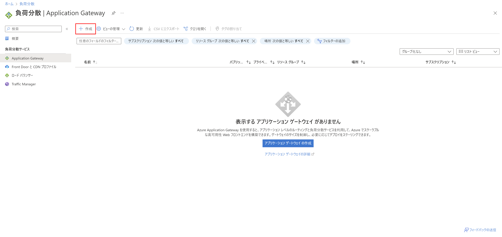
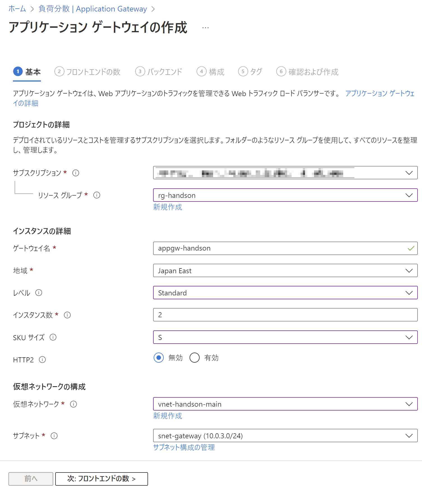
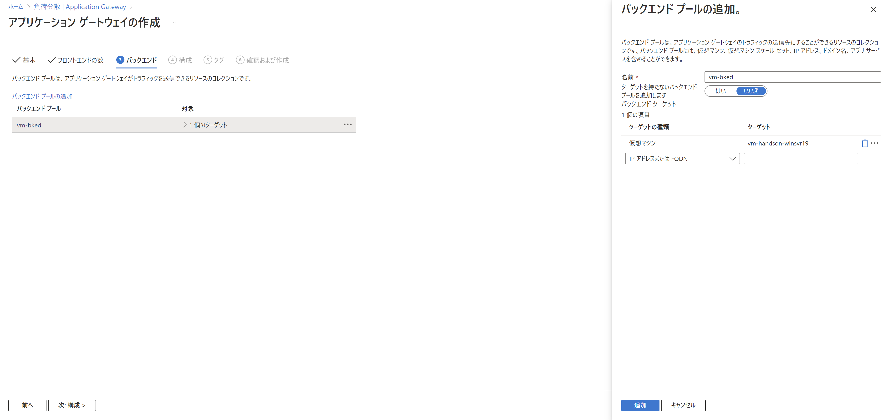
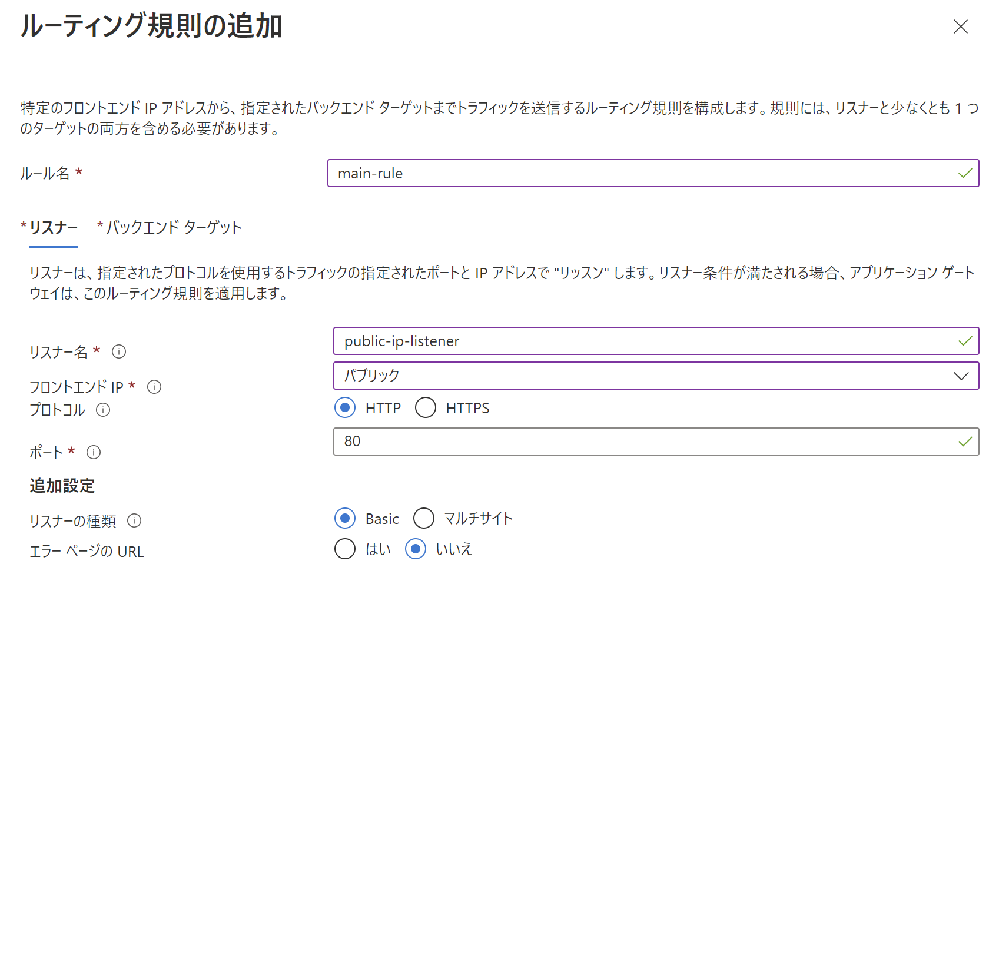
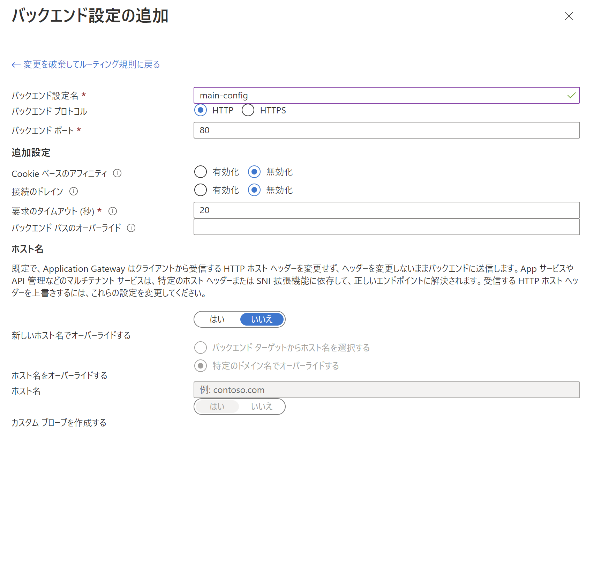
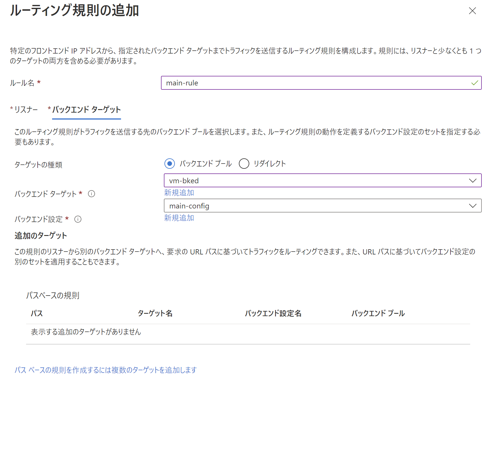
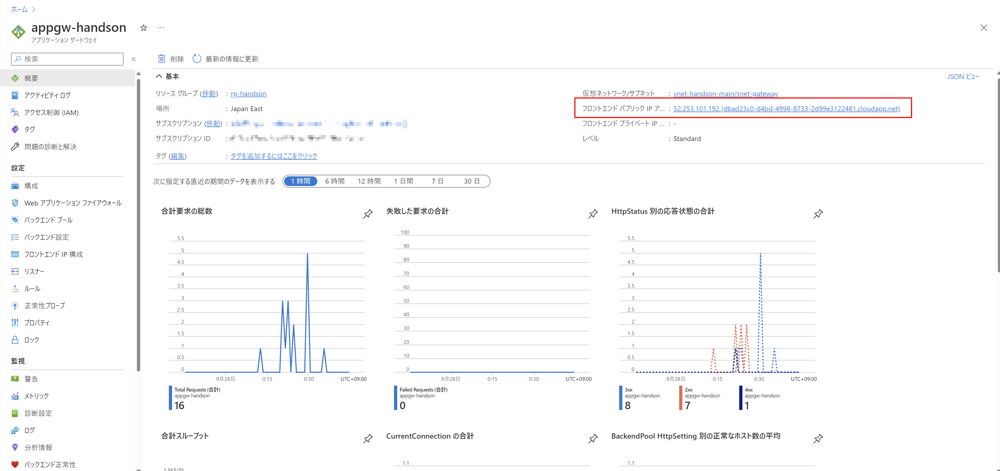
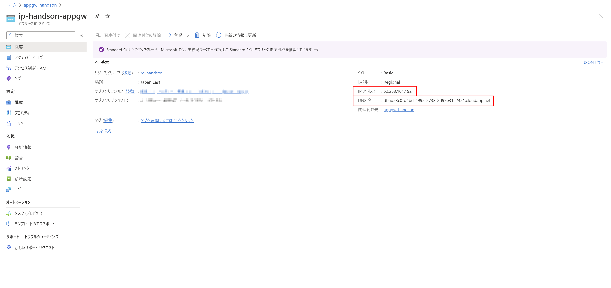
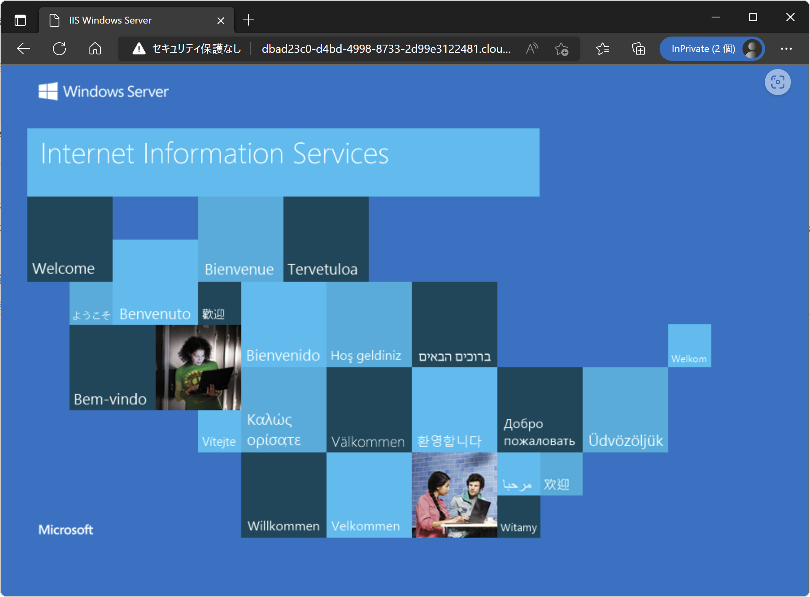

# Exercise4: Application Gateway 作成

## 【目次】

1. [NSGの設定](#nsgの設定)
1. [Application Gateway 作成](#application-gateway-作成)
1. [Application Gateway 動作確認](#application-gateway-動作確認)

## NSGの設定

1. Azureポータル上部の検索窓で「ネットワークセキュリティグループ」を検索、開く

1. 「アプリケーションゲートウェイ」を配置するサブネット（ `snet-gateway` ) 用のNSG を開く

1. [設定]-[受信セキュリティ規則]を開く

1. 「追加」を選択して Gateway Manager からの受信許可を設定

    * ソース： `Service Tag`
    * ソースサービスタグ： `GatewayManager`
    * ソースポート範囲： `*`
    * 宛先： `Any`
    * サービス： `Custom`
    * 宛先ポート範囲： `65503-65534`
    * プロトコル： `TCP`
    * アクション： `許可`
    * 優先度： (100以上の任意の数値)
    * 名前： (任意)

    

1. 同様に 「LoadBalancer」、「HTTP」、「HTTPS」を許可

    * AzureLoadBalancer
        * ソース： `Service Tag`
        * ソースサービスタグ： `AzureLoadBalancer`
        * ソースポート範囲： `*`
        * 宛先： `Any`
        * サービス： `Custom`
        * 宛先ポート範囲： `*`
        * プロトコル： `Any`
        * アクション： `許可`
        * 優先度： (100以上の任意の数値)
        * 名前： (任意)
    * HTTP
        * ソース： `Any`
        * ソースポート範囲： `*`
        * 宛先： `Any`
        * サービス： `HTTP`
        * アクション： `許可`
        * 優先度： (100以上の任意の数値)
        * 名前： (任意)
    * HTTPS
        * ソース： `Any`
        * ソースポート範囲： `*`
        * 宛先： `Any`
        * サービス： `HTTPS`
        * アクション： `許可`
        * 優先度： (100以上の任意の数値)
        * 名前： (任意)

## Application Gateway 作成

1. Azureポータル上部の検索窓で「アプリケーションゲートウェイ」を検索、開く

1. 「作成」を選択

    

1. アプリケーションゲートウェイの作成

    1. 「基本」ページ

        * サブスクリプション：（ハンズオン用のもの）
        * リソースグループ：（最初に作成したもの）
        * ゲートウェイ名： （任意）
        * 地域： `Japan East`
        * レベル： `Standard`
        * インスタンス数： `2`
        * SKUサイズ： `S`
        * 仮想ネットワーク： (最初に作成したもの)
        * サブネット： `snet-gateway` （アプリケーションゲートウェイ用のサブネット）

        

    1. 「フロントエンドの数」ページ

        * フロントエンドIPの種類： `パブリック`
        * パブリックＩＰアドレス： (新規作成)

        

    1. 「バックエンド」ページ

        * バックエンドプール：
            * 名前： (任意)
            * ターゲット： `仮想マシン` を選択して 作成済みの仮想マシン を選択

        

    1. 「構成」ページ

        「ルーティング規則の追加」を選択して、「ルーティング規則」を追加

        * ルール名： (任意)

        1. 「リスナー」を設定

            * リスナー名： (任意)
            * フロントエンドIP： `パブリック`

            

        1. 「バックエンドターゲット」を設定

            * ターゲットの種類： `バックエンドプール` 、あらかじめ設定した VM に向けたバックエンドプール
            * バックエンドターゲット： (新規追加から作成)

                

            

    1. 「タグ」ページ

        特に指定なし

    1. 「確認および作成」ページ

        内容を確認して「作成」

## Application Gateway 動作確認

1. Azureポータルから作成した「アプリケーションゲートウェイ」を開く

1. 「概要」にある「フロントエンドパブリックIPアドレス」を選択

    

1. パブリックIPアドレスの「IPアドレス」または「DNS名」を確認

    

1. ブラウザ（シークレットモード）を立ち上げて、確認したアドレスへアクセス

    Application Gateway 経由で IIS へアクセスできることを確認

    

# すべて完了 🎉

不要なリソースグループは削除して終わりになります。

* [クリーンアップ](exercise99.md)
